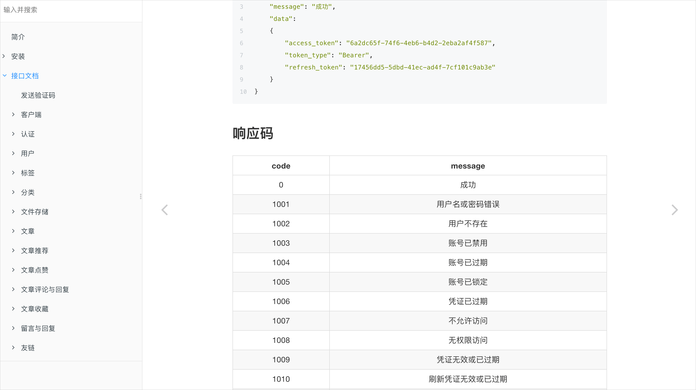

## 前言

做开发也有挺长一段时间了，都挺忙的，平时也会看些书，或者做一些笔记，有时间就逛逛Github，刷刷掘金什么的，看看别人的见解，涨涨见识，看到好的文章也会选择收藏起来。逐渐地，我也意识到自己也该写写总结，写写一些自己的想法了。稍加思索后，冷静识破。于是决定自己写一个博客API系统，至于为啥是博客API系统而不是博客系统主要是基于两个方面的考虑：一是博客API是提供博客接口，前端页面可另外写，页面设计、风格可自由发挥，不强依赖后台服务，即便不会后台的伙伴也可以基于博客API自己搭建一个自己心仪的博客。二是个人平时开发也大都是前后端分离的开发模式，还是比较喜欢前后端分离的这种开发模式。
出于对开源社区的敬意，将项目开源出来大家共同学习，希望对大家有所帮助。当然，本人水平有限，也欢迎大家指出存在的缺陷或不严谨的地方。

> 前端项目地址：https://github.com/copoile/blog-web.git


## 简介

项目为java语言编写的一个博客API系统，上手简单，配置灵活，有完整的接口说明文档，接口丰富，接口具备认证授权、鉴权、参数校验、限流等功能。认证方式采用token认证方式，并且区分客户端。 热点数据使用redis缓存，数据库使用mysql。项目接入第三方阿里云短信服务，此服务需到阿里云平台开通。
文件存储方面，项目提供4种选择，分别为本地存储、阿里云对象存储、网易云对象存储、七牛云对象存储，至于使用哪种看个人的选择，需要注意的是本地存储需要配置代理（如nginx）进行读取,这么做主要是基于两方面的考虑，一是tomcat相对其他静态文件服务器而言并不是很擅长读取静态文件。二是前端项目也需要一个静态文件服务器，可以用前端静态文件服务器代理读取。

> 使用第三方文件存储主要是为了分担服务器带宽压力。将静态文件放到1MB带宽的服务器上，读取的时候你将体会到什么叫龟速。




 ## 技术架构

采用SpringBoot2.0、MyBatis-Plus、Security等框架。


## 功能

```
- 账号注册
- 账号登录 / 手机号登录
- 个人信息
- 绑定邮箱 / 绑定手机号
- 修改密码 / 重置密码
- 文章编辑
- 文章管理
- 文章推荐
- 用户管理
- 分类管理
- 标签管理
- 收藏管理
- 博客友链
- 客户端管理
- 首页
- 分类
- 归档
- 标签
- 友链
- 留言
- 文章 / 收藏 / 点赞 / 评论 / 回复 / 相关推荐
- 其他
```


## 开发环境

- **JDK 1.8 +**
- **Maven 3.5 +**
- **IntelliJ IDEA ULTIMATE 2018.2 +** (*注意：建议使用 IDEA 开发，同时保证安装 `lombok` 插件，如果是eclipse也要确保安装了`lombok` 插件*)
- **Redis 3.0 +**
- **Mysql 5.7 +**


## 文档

<a href="http://doc.poile.cn" target="_black">http://doc.poile.cn</a>
